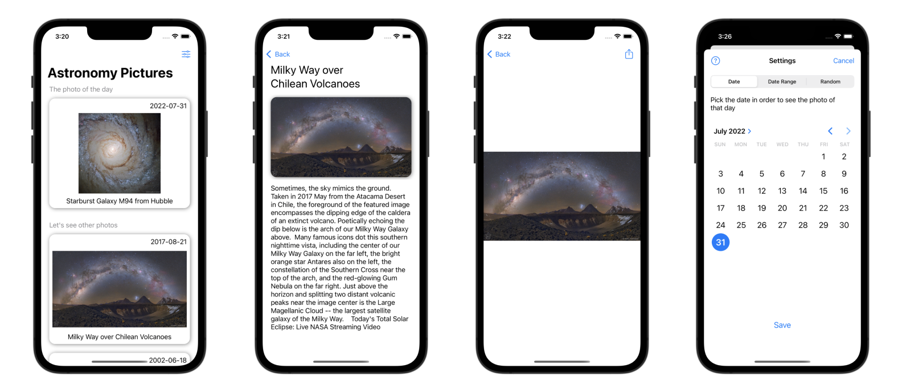

# APOD

Приложение Astronomy Picture of The Day (APOD) представляет собой клиент, который взаимодействует с API сервера NASA ([apod.nasa.gov](https://apod.nasa.gov/)) и позволяет загружать изображения на космическую тематику, опубликованные на этом сервере. Каждое изображение имеет короткое описание. Иногда вместо изображения публикуется видео.

## Основные функции:

* Автоматическая загрузка изображения дня.
* Загрузка изображений за определенную дату или диапазон дат. Архив ведется с 16 июня 1995 года.
* Загрузка случайных изображений, хранящихся на сервере (до 50 за один запрос).
* Если вместо изображения доступно видео, его можно посмотреть в приложении.
* Сохранение настроек и кеширование изображений.
* Просмотр изображений с возможностью зумить (как в приложении Apple Photos).
* Шеринг и сохранение изображений на устройстве.
* Светлая и темная тема зависит от настроек устройства.

